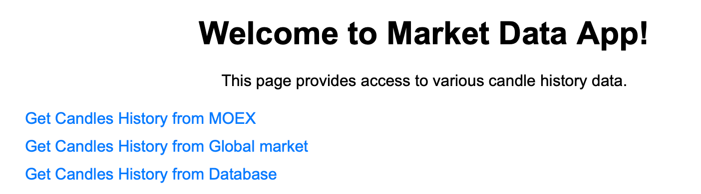
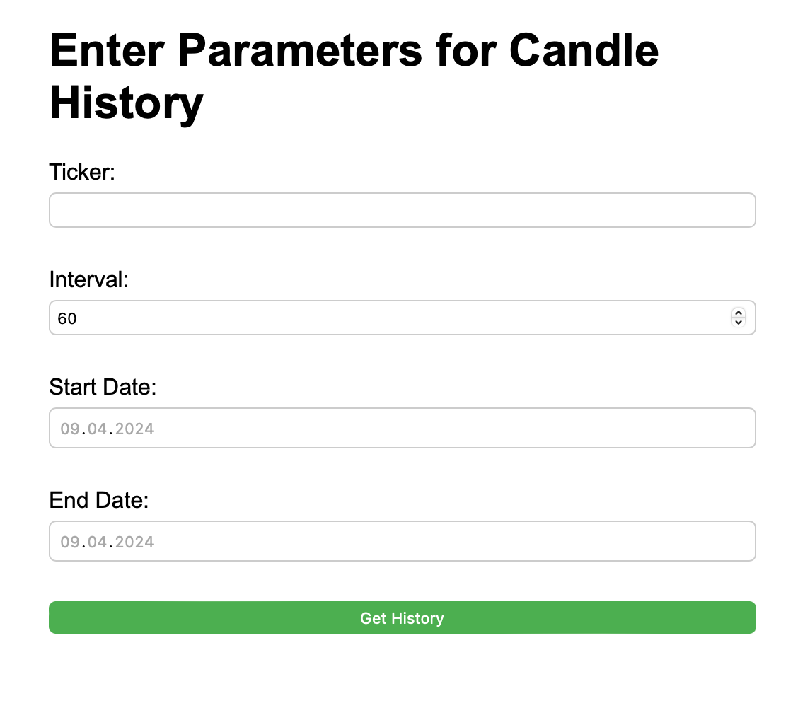

[](https://git.io/typing-svg)
## 🚀 About
The application allows you to receive stock exchange data on financial instruments (quotes, candles and other information).
This Spring Boot application is a server for receiving stock data from different sources.  
App supports saving and loading data from a local MongoDB database. To use the feature, you must create a MongoDB database. The default database name is `financialdata_db`, port 27017. You can set your name and port in `application.properties`.

## ⭐ Features
- Stock prices history from MOEX ISS (https://www.moex.com/a2193)
- Historic candles from AlphaVantage (https://www.alphavantage.co/)
- Financial reports from AlphaVantage: income statement, balance sheet, cash flow statement
- Commodity prices: Crude Oil, Natural Gas, Copper, Aluminium, Wheat, Corn, Cotton, Sugar, Coffee 
- Saving data to a local repository (PostgreSQL)
- Calculation of analytical indicators
- Uploading data for all tickers in your database from the last date to the current one (from MOEX only)
- Export candles history in CSV format
- Web client for the most requested functions
- Upload and updating financial reports for all tickers in your DB

## 💻 Usage
### 1. Historic candles  
Server endpoint:
```java
GET /api/moex/shares/[ticker]/history // from MOEX ISS
GET /api/global/shares/[ticker]/history // from AlphaVantage
GET /api/commodity/[commodity]/history // commodity price
GET /api/repo/shares/[ticker]/history // history from database
```
Request parameters:
* `ticker` - stock ticker
* `candlesize` - candle time period. Possible values: 1 (1 minute), 10 (10 minutes), 60 (1 hour), 24 (1 day), 7 (1 week), 31 (1 month) or 4 (1 quarter)
* `startdate` - start date for receiving candles
* `enddate` - end date for receiving candles
* `apikey` - API key from AlphaVantage (parameter for AlphaVantage only)

Example of request:
```java
GET /global/shares/IBM/history?candlesize=60&startdate=2023-03-01&enddate=2023-04-01&apikey=demo
```

### 2. Getting company reports  
**IMPORTANT!** In this paragraph and further in all methods of obtaining reports. If the AlphaVantage API returns the value “None” for any of the value from report, it is returned and saved to the database as a special value -1. Be careful and keep this in mind.  
The method allows you to obtain an income statement. First, the request is sent to the database. If the values are found, a response from the database is returned. If not found, a request is sent to AlphaVantage. The received data is saved to the database.
```java
GET /api/reports/{ticker}/overview // company overview
GET /api/reports/{ticker}/pnl // income statement
GET /api/reports/{ticker}/bs // balance sheet
GET /api/reports/{ticker}/cf // cash flow
GET /api/reports/upload // upload reports for all tickets in company_overview table
```

Request parameters:
* `ticker` - company stock ticker (not necessary for upload method)
* `apikey` - API key from AlphaVantage


### 3. Upload historic candles to Database
```java
GET /repo/reload/moex
```
Request parameters:
* `defaultStartDate` - if there is no date for the specified candle size for ticker in your database, additional loading will begin from this date

### 4. Export candles to CSV
#### Request CSV history candles from MOEX ISS:
```java
GET /api/moex/shares/[ticker]/export-to-csv // get CSV from MOEX ISS
GET /api/global/shares/[ticker]/export-to-csv // get CSV from AlphaVantage
GET /api/repo/shares/[ticker]/export-to-csv // get CSV from database
```
Request parameters: same as 1-3 above

### 5. WebClient



## 🛠️ Technology stack
- Java 17 
- Spring Boot - version 3.2.2
- PostgreSQL 16
- JDBC, JPA
- Spring MVC

## 📖 Disclaimer
The author does not accept responsibility for actions taken on the basis of information obtained as a result of using this program. The author does not represent that the information or opinions provided are correct or complete. The information presented shouldn't be used as the sole guide for making investment decisions. Doesn't individual investment advice.